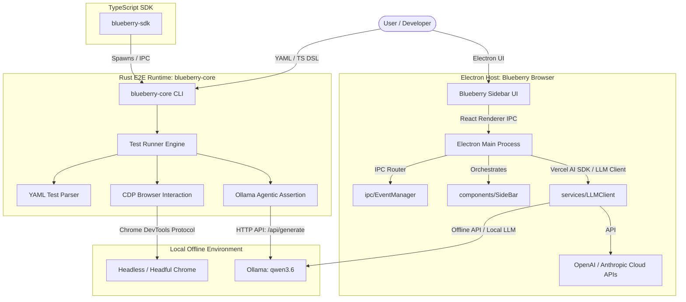

# Blueberry Browser Architecture

Welcome to the **Blueberry Browser** and **Blueberry Playwright** central architecture review document. This document acts as a high-fidelity blueprint and status report detailing the unified system design, completed restructurings, dependency modernizations, and the AI-native end-to-end (E2E) testing framework.

---

## 🗺️ Architectural Ecosystem Overview

Blueberry Browser is a highly modern, AI-enhanced Electron application built with React, TypeScript, and Rust. The ecosystem is designed to deliver both a premium browsing environment and an offline-first, AI-native E2E testing framework (**Blueberry Playwright**).



---

## 🛠️ Technology Stack & Toolchain

### 1. Unified Toolchain: Vite+ (`vp`)

Rather than relying on classic separate lint, test, format, and bundler utilities, this codebase has been migrated to **Vite+**—a modern, unified toolchain wrapper built on top of high-performance tools:

- **Vite & Rolldown**: Underpinning bundler/bundling layer.
- **tsdown**: Fast TypeScript compilation.
- **Oxlint & Oxfmt**: Ultra-fast Rust-powered linting and formatting.
- **Vite Task**: Integrated script running and configuration lifecycle.
- **`vp` CLI**: Standardized project manager replacing fragmented run commands (`vp install`, `vp check`, `vp build`, `vp run <script>`).

### 2. Electron Frontend Runtime

- **Electron (v43.0.0)**: Chromium-powered main process shell.
- **React (v19.2.7) & TypeScript (v6.0.3)**: High-performance renderer UI with TailwindCSS and custom CSS layers.
- **Vercel AI SDK (v7.0.15)**: Integrated streaming LLM pipeline.

### 3. Native E2E Test Runner (`blueberry-core`)

- **Rust (edition 2021)**: Lightweight, memory-safe testing backend.
- **`headless_chrome` CDP Client**: Native Rust bindings to direct Chrome DevTools Protocol websocket connections (speed-optimized, zero external binary dependency on Node WebDriver).
- **`serde` & `serde_yaml`**: Strongly-typed schema deserialization for YAML test files.

---

## 📂 Codebase Restructuring & Directory Map

To support scalability, we standardized the folder structure of the main process from a flat array of loose files into a clean **Model-View-Component (MVC) and Service-Oriented pattern** conforming to modern production-grade Vite+ applications.

```
blueberry-browser/
├── blueberry-core/               # Rust-based E2E Test Runner
│   ├── Cargo.toml                # Rust package manifest
│   └── src/
│       ├── main.rs               # CLI interface, runner, and orchestrator
│       ├── browser.rs            # Chrome DevTools Protocol interaction engine
│       ├── yaml_parser.rs        # YAML deserialization & AST schemas
│       └── ollama_agent.rs       # Semantic AI Agent loop for offline assertions
├── src/
│   ├── main/                     # Electron Main Process (Modularized)
│   │   ├── index.ts              # System bootstrap & entrypoint
│   │   ├── components/           # Window, sidebars, tabs, menu logic
│   │   │   ├── Window.ts
│   │   │   ├── Menu.ts
│   │   │   ├── SideBar.ts
│   │   │   ├── Tab.ts
│   │   │   └── TopBar.ts
│   │   ├── ipc/                  # Main-to-Renderer IPC Bridges
│   │   │   └── EventManager.ts
│   │   └── services/             # External integration services
│   │       └── LLMClient.ts      # Multi-provider chat client (OpenAI, Anthropic, Ollama)
│   ├── renderer/                 # React UI layer
│   └── preload/                  # Electron security preloads
├── AGENTS.md                     # Custom agent developer instructions
├── package.json                  # Pinned, non-drifting dependency index
└── pnpm-workspace.yaml           # Monorepo / local package catalog config
```

---

## 🧩 Deep-Dive: Component Architecture

### 1. Main Process Components (`src/main/components`)

- **`Window.ts`**: Encapsulates `BrowserWindow` generation, custom sidebar injection, glassmorphism UI window states, and lifecycle hooks.
- **`Tab.ts`**: Implements browser tab isolation. Directly interfaces with Chromium's webContents, enabling title/URL synchronization, screenshot generation, and custom JavaScript-to-Text contexts.
- **`SideBar.ts`**: Orchestrates the persistent LLM companion panel. Injects a custom sidebar view aligned with the viewport layout.
- **`TopBar.ts`**: Core browser controls (back, forward, refresh, address bar binding).
- **`Menu.ts`**: Context and OS menu overrides.

### 2. Main Process IPC & Services

- **`ipc/EventManager.ts`**: The central communication hub. Listens to IPC requests from the sidebar and topbar renderers, handles browser navigation triggers, and routes streaming LLM tokens.
- **`services/LLMClient.ts`**: Integrated stream-processing LLM router supporting **OpenAI (GPT-4o-mini)**, **Anthropic (Claude 3.5 Sonnet)**, and **Ollama (Local Offline/Offline-first)**. It captures screenshots of active tabs directly on chat message submission, sending raw image payloads alongside page textual context to provide multimodal web assistance.

---

## 🤖 Blueberry Playwright Engine (`blueberry-core`)

The defining competitive feature of Blueberry Browser is **Blueberry Playwright**—an offline-first, AI-native alternative to Playwright designed to operate on local resources via Ollama.

### 1. E2E Test Plan Steps (AST Schema)

E2E tests are represented as highly readable YAML suites. Below is the parser schema mapping defined in `yaml_parser.rs`:

| Step Command     | Serialization Format                     | Functional Description                                            |
| :--------------- | :--------------------------------------- | :---------------------------------------------------------------- |
| **`navigate`**   | `navigate: "URL"`                        | Loads the specified URL and waits for page load resolution        |
| **`click`**      | `click: "selector"`                      | Resolves selector in DOM and triggers a physical click event      |
| **`type`**       | `type: { selector: "...", text: "..." }` | Clears target input field and types input text sequentially       |
| **`wait`**       | `wait: milliseconds`                     | Sleep execution thread for the requested duration                 |
| **`wait_for`**   | `wait_for: "selector"`                   | Block thread and poll for selector existence up to a 10s timeout  |
| **`screenshot`** | `screenshot: "filepath.png"`             | Captures a high-resolution PNG of the viewport                    |
| **`agent`**      | `agent: "natural language prompt"`       | Triggers the Ollama Agent semantic evaluation (Visual Assertions) |

### 2. CLI Executable Commands

The Rust binary compiles into a command-line utility called `blueberry-core` exposing two core subcommands:

- `blueberry-core run <file.yaml> [--headful]`: Loads a test suite from disk, spawns a headless (or headful) Chrome browser via CDP, executes each step, and logs comprehensive execution timing.
- `blueberry-core agent "<prompt>" --context-file <file.txt>`: Offline utility to evaluate local page content files directly through Ollama.

### 3. The Agentic Assertion Cycle (`ollama_agent.rs`)

Traditional testing requires brittle CSS assertions (e.g. `expect(el.text()).toContain("Success")`). Blueberry Playwright introduces semantic testing:

```
[YAML Step: agent]
       │
       ▼
[browser.rs] ──► Extracts Body InnerText
       │
       ▼
[ollama_agent.rs] ──► Formulates structured LLM payload with System Rules
       │
       ▼
[Ollama HTTP API] ──► Submits raw payload to '/api/generate' (Model: qwen3.6)
       │
       ▼
[Strict JSON Extraction] ──► Extracts and deserializes response:
                             {
                               "success": true | false,
                               "reason": "..."
                             }
       │
       ▼
[Test Engine] ──► Logs semantic evaluation and proceeds or aborts test suite
```

> [!NOTE]
> **System Instruction Constraints**: The Ollama agent is configured with strict instructions to enforce a low temperature (0.1) for deterministic evaluations and output a strict JSON payload. Markdown wrapping formatting is automatically detected and stripped before deserialization.

---

## 🚀 Future Integrations & Extensions

### 1. TypeScript SDK Builder Pattern (`blueberry-sdk`)

To allow developers to code their E2E tests programmatically, a lightweight TypeScript SDK is designed to sit alongside the Rust binary. The SDK implements a builder design pattern compiling via `tsc`:

```typescript
import { Blueberry } from "blueberry-sdk";

const test = new Blueberry();
await test
  .navigate("https://news.ycombinator.com")
  .wait_for(".storylink")
  .screenshot("hacker_news.png")
  .agent("Verify that there is a story about artificial intelligence on the front page")
  .run();
```

### 2. Sidebar Test Dashboard UI (`TestRunner.tsx`)

Integration of a dedicated test monitoring suite into the Electron Renderer Sidebar:

- **YAML Registry**: Auto-detects local `.yaml` test plans in a `tests/` workspace folder.
- **Execution Panel**: Start/stop controls triggering the `blueberry-core` CLI via the Electron main-to-local shell process.
- **Real-time Console**: Stream stdout/stderr logs from the Rust compiler and CDP engine directly into a beautiful dark-mode terminal window with glassmorphism styling.
- **Interactive Gallery**: Real-time display of captured PNG screenshots showing exactly where the agent is running in Chrome.
- **Natural Language Generation**: Interactive dialog with the sidebar LLM companion to describe a test flow (e.g. _"Create a test that searches for Apple on Google"_), generating and saving a production-ready `.yaml` E2E test.

---

## 🧹 Repository Hygiene & Policies

To keep our codebase premium and ensure that we maintain high software engineering standards, we enforce the following rules:

> [!IMPORTANT]
> **1. Version Pinning**: All packages inside `package.json` are fixed and pinned to exact versions (e.g. `"react": "19.2.7"` instead of `^19.1.0`). Pinned versions prevent dependency-drift bugs across developer workspaces.
>
> **2. Build Artifact Isolation**: All compiled type-definition files (`*.d.ts`) must never be committed to VCS. Build steps or local script generation tools (e.g. `vp check` or `tsc`) should regenerate these files dynamically on the developer machine.
>
> **3. Continuous Verification**: Developers should always run the local unified toolchain validation commands `vp check` (for Oxlint/Oxfmt compilation, lints, and format rules) and `vp build` before pushing code changes to guarantee zero syntax or compilation regressions.
