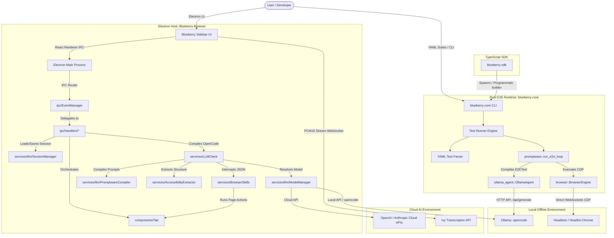

# Blueberry Browser Architecture

Welcome to the **Blueberry Browser** and **Blueberry Playwright** central architecture review document. This document acts as a high-fidelity blueprint and status report detailing the unified system design, codebase advancements, the self-evolving Promptware framework, and the AI-native end-to-end (E2E) testing runtime.

---

## 🗺️ Architectural Ecosystem Overview

Blueberry Browser is an AI-native desktop browser and testing platform. The ecosystem integrates an Electron and React desktop application, an offline-first AI core, and a lightweight, high-performance Rust E2E runtime.



---

## 🛠️ Technology Stack & Toolchain

### 1. Unified Toolchain: Vite+ (`vp`)

The project utilizes **Vite+**—a high-performance, consolidated web development toolchain that unifies building, formatting, linting, and environment workflows:

- **Vite & Rolldown**: Advanced bundler and client-side bundler layer.
- **tsdown**: Fast, lightweight compiler for TypeScript.
- **Oxlint & Oxfmt**: Rust-powered linting and formatting utilities delivering near-instant validation.
- **Vite Task**: Lifecycle integration managing monorepos and local developer runs.
- **`vp` CLI**: Single-entry CLI replacing loose scripts (`vp install`, `vp check`, `vp build`, `vp run <script>`).

### 2. Electron Desktop Runtime

- **Electron**: Chromium-powered main process environment.
- **React & TypeScript**: High-performance React renderer utilizing custom CSS variables.
- **TailwindCSS**: Integrated for layout styling.
- **Vercel AI SDK**: Standardized multi-provider LLM connector.
- **WebSocket PCM16 Transcription**: Direct connection to `wss://tendril-api.ivy.app/transcribe/ws` for streaming voice control.

### 3. Native Rust Core (`blueberry-core`)

- **Rust (Edition 2021)**: High-performance, memory-safe backend executable (`blueberry-core`).
- **`headless_chrome` CDP Client**: Direct WebSocket bindings communicating with the Chrome DevTools Protocol, eliminating heavy Node WebDriver and Java Selenium dependencies.
- **`serde` & `serde_json`**: Strongly typed serialization/deserialization for AST parsing and structured agent outputs.

---

## 📂 Codebase Directory Map

The repository is organized under a modularized monorepo/workspace-based architecture:

```
blueberry-browser/
├── src/
│   ├── browser/                  # Electron Host: Blueberry Browser
│   │   ├── main/                 # Electron Main Process (Modularized)
│   │   │   ├── index.ts          # System bootstrap & window management
│   │   │   ├── components/       # Window, menus, and browser frame logic
│   │   │   │   ├── Window.ts     # Main window & sidebar host
│   │   │   │   ├── Menu.ts       # Context & app menu systems
│   │   │   │   ├── SideBar.ts    # Floating AI assistant pane
│   │   │   │   ├── Tab.ts        # Isolation wrapper for webContents
│   │   │   │   └── TopBar.ts     # Browser frame headers and address controls
│   │   │   ├── ipc/              # Inter-Process Communication Bridges
│   │   │   │   ├── EventManager.ts # Direct IPC message routing & registration
│   │   │   │   └── handlers/     # Domain-specific IPC handlers
│   │   │   │       ├── BaseHandler.ts         # Abstract base class
│   │   │   │       ├── E2ETestHandler.ts      # Test runs, compilation, logging, and reflections
│   │   │   │       ├── HistoryHandler.ts      # Browsing history IPC bridge
│   │   │   │       ├── PageContentHandler.ts  # Active tab page extraction IPC
│   │   │   │       ├── SettingsHandler.ts     # Configuration and shortcut overrides
│   │   │   │       ├── SidebarHandler.ts      # Sidebar status IPC
│   │   │   │       ├── TabHandler.ts          # Tab creation and navigation events
│   │   │   │       └── ThemeHandler.ts        # CSS variables and system/dark mode IPC
│   │   │   ├── services/         # Core application services
│   │   │   │   ├── LLMClient.ts  # Master connection wrapper for AI
│   │   │   │   ├── AccessibilityExtractor.ts # Client-side DOM outline engine
│   │   │   │   ├── BrowserSkills.ts          # Page control actions registry & agent visuals
│   │   │   │   ├── HistoryManager.ts         # User browsing history persistence
│   │   │   │   ├── ChatHistoryManager.ts     # Saved chat sessions persistence
│   │   │   │   ├── SettingsManager.ts        # User settings and default shortcut options
│   │   │   │   └── llm/          # Modular LLM Sub-services
│   │   │   │       ├── ModelManager.ts       # LLM provider (OpenAI, Anthropic, Ollama)
│   │   │   │       ├── OllamaStreamFilter.ts # Formatting reasoning <think> stream for Ollama
│   │   │   │       ├── PromptwareCompiler.ts # Compile system prompt, memory files, and skills
│   │   │   │       └── SessionManager.ts     # Active chat session state tracking and persistence
│   │   │   └── utils/
│   │   │       ├── bounds.ts     # Window sizing & layout helpers
│   │   │       ├── promptware.ts # IPC-level promptware compilation utility functions
│   │   │       ├── shortcuts.ts  # Keyboard shortcuts register
│   │   │       └── windowOptions.ts # Base window options descriptor
│   │   ├── renderer/             # React App UI layer
│   │   │   ├── common/           # Shared components, hooks, type definitions, and libs
│   │   │   ├── settings/         # App settings app (SettingsApp.tsx)
│   │   │   ├── sidebar/          # Sidebar app
│   │   │   │   └── src/
│   │   │   │       ├── SidebarApp.tsx  # Sidebar layout router
│   │   │   │       ├── components/
│   │   │   │       │   ├── Chat.tsx           # Sidebar AI Chat UI & suggestions panel
│   │   │   │       │   ├── TestRunner.tsx     # E2E Test execution runner UI
│   │   │   │       │   └── voice-recorder.ts  # Real-time PCM16 voice capture client
│   │   │   │       └── contexts/
│   │   │   │           └── ChatContext.tsx    # App chat provider state
│   │   │   └── topbar/           # Browser window header address panel
│   │   └── preload/              # Electron secure bridges and API exposure
│   ├── promptwares/              # Self-evolving agentic application firmware
│   │   ├── OpenCode/             # Master browser companion chat loop
│   │   ├── E2ETest/              # Autonomous test runner loop
│   │   ├── AssertionAgent/       # Semantic assertion checking module
│   │   ├── ChatCompanion/        # Template-based offline conversational helper
│   │   └── HistoryAgent/         # Context-aware browser assistant suggestions agent
│   │       ├── system_prompt.md  # Immutable agent firmware instructions
   │       ├── user_prompt.md    # Substitutable template triggers
   │       ├── memory/           # Evolving markdown learnings/rules (ignored in git)
   │       └── logs/             # Run history and performance logs (ignored in git)
   ├── code/                     # Rust E2E CLI core (blueberry-core)
   │   ├── Cargo.toml            # Rust manifest
   │   └── src/
   │   	├── main.rs           # CLI interface & subcommand router
   │   	├── browser.rs        # Headless Chrome WebSocket controller
   │   	├── yaml_parser.rs    # YAML AST schema parser
   │   	├── promptware.rs     # Rust promptware compiler & runner
   │   	└── ollama_agent.rs   # Local Ollama client & assertion loop
   └── sdk/                      # TypeScript SDK (blueberry-sdk)
       └── src/index.ts          # Programmatic builder interface
   ├── AGENTS.md                     # Agent specific instructions & linter definitions
   ├── package.json                  # Pinned monorepo index
   └── pnpm-workspace.yaml           # Catalog configurations
```

### File Links

- Bootstrap Entry: [index.ts](file:///Users/rorychatt/git/rorychatt/blueberry-browser/src/browser/main/index.ts)
- Electron Main Window: [Window.ts](file:///Users/rorychatt/git/rorychatt/blueberry-browser/src/browser/main/components/Window.ts)
- Sidebar View Component: [SideBar.ts](file:///Users/rorychatt/git/rorychatt/blueberry-browser/src/browser/main/components/SideBar.ts)
- Web View Isolation wrapper: [Tab.ts](file:///Users/rorychatt/git/rorychatt/blueberry-browser/src/browser/main/components/Tab.ts)
- Main Event Manager: [EventManager.ts](file:///Users/rorychatt/git/rorychatt/blueberry-browser/src/browser/main/ipc/EventManager.ts)
- E2E Test Handler: [E2ETestHandler.ts](file:///Users/rorychatt/git/rorychatt/blueberry-browser/src/browser/main/ipc/handlers/E2ETestHandler.ts)
- LLM Service Client: [LLMClient.ts](file:///Users/rorychatt/git/rorychatt/blueberry-browser/src/browser/main/services/LLMClient.ts)
- Model Provider Manager: [ModelManager.ts](file:///Users/rorychatt/git/rorychatt/blueberry-browser/src/browser/main/services/llm/ModelManager.ts)
- Prompt Compiler: [PromptwareCompiler.ts](file:///Users/rorychatt/git/rorychatt/blueberry-browser/src/browser/main/services/llm/PromptwareCompiler.ts)
- Chat Session Manager: [SessionManager.ts](file:///Users/rorychatt/git/rorychatt/blueberry-browser/src/browser/main/services/llm/SessionManager.ts)
- Browser History Persistence Manager: [HistoryManager.ts](file:///Users/rorychatt/git/rorychatt/blueberry-browser/src/browser/main/services/HistoryManager.ts)
- Chat History Persistence Manager: [ChatHistoryManager.ts](file:///Users/rorychatt/git/rorychatt/blueberry-browser/src/browser/main/services/ChatHistoryManager.ts)
- Settings Persistence Manager: [SettingsManager.ts](file:///Users/rorychatt/git/rorychatt/blueberry-browser/src/browser/main/services/SettingsManager.ts)
- Browser Skills & Vignette Injected Visuals: [BrowserSkills.ts](file:///Users/rorychatt/git/rorychatt/blueberry-browser/src/browser/main/services/BrowserSkills.ts)
- DOM Outliner: [AccessibilityExtractor.ts](file:///Users/rorychatt/git/rorychatt/blueberry-browser/src/browser/main/services/AccessibilityExtractor.ts)
- Chat Screen Renderer UI: [Chat.tsx](file:///Users/rorychatt/git/rorychatt/blueberry-browser/src/browser/renderer/sidebar/src/components/Chat.tsx)
- Real-time Voice Capture: [voice-recorder.ts](file:///Users/rorychatt/git/rorychatt/blueberry-browser/src/browser/renderer/sidebar/src/components/voice-recorder.ts)
- Settings React UI: [SettingsApp.tsx](file:///Users/rorychatt/git/rorychatt/blueberry-browser/src/browser/renderer/settings/src/SettingsApp.tsx)
- Rust Entrypoint: [main.rs](file:///Users/rorychatt/git/rorychatt/blueberry-browser/src/code/src/main.rs)
- Rust promptware loop: [promptware.rs](file:///Users/rorychatt/git/rorychatt/blueberry-browser/src/code/src/promptware.rs)
- TS SDK Index: [index.ts](file:///Users/rorychatt/git/rorychatt/blueberry-browser/src/sdk/src/index.ts)

---

## 🧩 The Promptware Framework

**Promptwares** are self-contained, "evolving agentic applications" designed to compile dynamically, query local/remote LLMs, record execution logs, and write persistent, self-improving memory reflections.

### 1. File Structure of a Promptware Folder

Each promptware folder (e.g. `AssertionAgent`, `E2ETest`, `OpenCode`, `HistoryAgent`) operates as an isolated package:

1. **Firmware (`system_prompt.md` or `Program.md`)**: The immutable, system-level instructions directing the agent's core capabilities, operating constraints, and expected output format.
2. **Trigger (`user_prompt.md`)**: A markdown template compiled at runtime, substituting variables wrapped in double-curly braces (e.g., `{{CurrentUrl}}`, `{{Prompt}}`).
3. **Memory (`memory/*.md`)**: Persistent, user-editable markdown files where the agent reads compiled historical learnings and writes back reflections after each execution loop. (Ignored in git to prevent constant developer workflow conflicts).
4. **Logs (`logs/*.md`)**: Dynamic job output transcripts detailing timestamps, extracted parameters, model responses, and actions. (Ignored in git).

### 2. Compilation and Substitution Pipeline

When a promptware is compiled (by [PromptwareCompiler.ts](file:///Users/rorychatt/git/rorychatt/blueberry-browser/src/browser/main/services/llm/PromptwareCompiler.ts) in JS or [promptware.rs](file:///Users/rorychatt/git/rorychatt/blueberry-browser/src/code/src/promptware.rs) in Rust):

- The compiler loads the core firmware file.
- It scans the `memory/` directory, aggregating all accumulated learnings, reflections, and historical rules into the system prompt context.
- It injects execution-specific headers (e.g., `CurrentTime`, `CurrentUrl`, `PageContent`, `AccessibilityContext`).
- If required, it substitutes custom markdown placeholders (such as `{{BrowserSkills}}`) with detailed API instructions parsed from [BrowserSkills.ts](file:///Users/rorychatt/git/rorychatt/blueberry-browser/src/browser/main/services/BrowserSkills.ts).

---

## 🤖 The Electron Sidebar & Master Agents

### 1. OpenCode Interactive Chat Loop

The persistent LLM Companion Panel (the Sidebar chat) is orchestrated by the **OpenCode** master browser agent.

````
[User Message] ──► [LLMClient] ──► Extracts tab screenshot (multimodal)
                         │
                         ▼
        Compiles OpenCode Promptware with context:
        - CurrentTime, CurrentUrl
        - PageContent (Truncated)
        - AccessibilityContext (from AccessibilityExtractor)
                         │
                         ▼
             [Streaming LLM Response]
                         │
                         ▼
             Check for JSON Code Block:
             ```json
             { "action": "click", "params": { "selector": "#btn" } }
             ```
                         │
                         ▼
          [EventManager / BrowserSkills] Executes Action
                         │
                         ▼
        State Changed? ──► YES ──► (Sleep 1.5s) ──► Re-trigger OpenCode Loop!
            │
            └──► NO ──► Render final explanation to User
````

- **AccessibilityExtractor**: To feed lightweight but complete DOM context to the agent without exceeding LLM context windows, [AccessibilityExtractor.ts](file:///Users/rorychatt/git/rorychatt/blueberry-browser/src/browser/main/services/AccessibilityExtractor.ts) runs client-side DOM-inspection scripts to build a highly structured, semantic Markdown outline.
- **BrowserSkills & Dynamic Permissions**: [BrowserSkills.ts](file:///Users/rorychatt/git/rorychatt/blueberry-browser/src/browser/main/services/BrowserSkills.ts) handles the execution of actions parsed from the agent's JSON output. It maps schema parameters to programmatic browser APIs and manages a dynamic permissions gate.
- **Agent Visuals & Vignette Overlay**: To indicate to the user that the AI is actively controlling the page, [BrowserSkills.ts](file:///Users/rorychatt/git/rorychatt/blueberry-browser/src/browser/main/services/BrowserSkills.ts) injects a glowing border vignette CSS effect (`.blueberry-vignette`), a pulsing agent status badge (`.blueberry-badge`), and draws an animated virtual cursor (`.blueberry-cursor`) matching the target element coordinates.

### 2. HistoryAgent suggestions

The Suggestions Panel is powered by the **HistoryAgent** promptware. It runs asynchronously in the background when the user navigates:

- Reads the user's local history file (`history.json`) and the current page context.
- Generates 3-5 suggestions containing contextual search terms or pages to revisit.
- Returns a structured JSON output with a `reason` and `reflection_title` to summarize user context.

---

## ⚡ Rust Dynamic E2E Test Runner (`blueberry-core`)

The localized alternative to Playwright is the compiled `blueberry-core` Rust binary. It parses YAML test plans and supports both classical sequential actions and completely autonomous Promptware-driven E2E loops.

### 1. YAML Parser Schema Layout ([yaml_parser.rs](file:///Users/rorychatt/git/rorychatt/blueberry-browser/src/code/src/yaml_parser.rs))

Test suites are declared in highly structured YAML configurations. The engine supports two execution branches:

#### Option A: Classical Step-by-Step Executions

```yaml
name: "Search Flow Test"
steps:
  - navigate: "https://www.google.com"
  - wait_for: "input[name='q']"
  - type:
      selector: "input[name='q']"
      text: "Blueberry Browser"
  - click: "input[type='submit']"
  - wait: 2000
  - screenshot: "google_results.png"
  - agent: "Verify that 'blueberry' is shown in the search results"
```

#### Option B: E2E Promptware Autonomous Loop

```yaml
name: "Search Flow Autonomous Agent Test"
prompt: "Search for Blueberry Browser on Google and verify that the results are loaded correctly"
```

### 2. Rust Promptware Run Loop ([promptware.rs](file:///Users/rorychatt/git/rorychatt/blueberry-browser/src/code/src/promptware.rs))

If a YAML file specifies a global `prompt` instead of a static sequence of `steps`, the Rust runner launches an **Autonomous Agent Loop**:

1. It initializes an active `BrowserEngine` viewport and registers a randomized `job_id`.
2. It extracts the current URL and page text context (automatically truncating deep text blocks to 5,000 characters to optimize local LLM latency).
3. It compiles the local `E2ETest` Promptware, stitching the user's objective, compiled memory logs, and current page context into an LLM system prompt.
4. It calls the local Ollama API (`/api/generate` using `opencode`), pulling a deterministic low-temperature response.
5. It parses the returned JSON action. If the action is a page navigation or interaction, it executes it through WebSocket CDP channels and iterates.
6. The loop continues for up to 20 steps. At conclusion (success or failure), it outputs a final `reflection` written back to `E2ETest/memory/learnings.md` and saves the complete transcript inside `E2ETest/logs/job_*.md`.

### 3. CLI Subcommand Reference

`blueberry-core` exposes the following terminal utilities:

- `blueberry-core run <file.yaml> [--headful]`: Loads and runs a step-based or prompt-based E2E test plan.
- `blueberry-core agent "<prompt>" --context-file <file.txt>`: Quick CLI utility to verify assertions on offline text contexts.
- `blueberry-core promptware-run <name> --input "<text>"`: Directly compiles and runs any promptware module offline.
- `blueberry-core promptware-read-memory <name> <filename>`: Reads compiled learnings.
- `blueberry-core promptware-write-memory <name> <filename> <content>`: Overwrites/updates promptware memories.

---

## 🧹 Repository Hygiene & Policies

To ensure stability across developer workspaces, the codebase strictly enforces:

> [!IMPORTANT]
> **1. Package Version Pinning**: All dependencies inside `package.json` are fixed and pinned to exact, deterministic versions. Carets (`^`), tildes (`~`), and `latest` modifiers are strictly forbidden.
>
> **2. Clean Types Compilation**: Automatically generated type declaration files (`*.d.ts`) must never be checked into git. Let `vp check` or typescript configurations recompile definitions dynamically.
>
> **3. Continuous Verification**: Before pushing features or finalizing refactors, always execute `vp check` (running Oxlint and Oxfmt linting/formatting tests) and `vp build` to guarantee compilation success.
